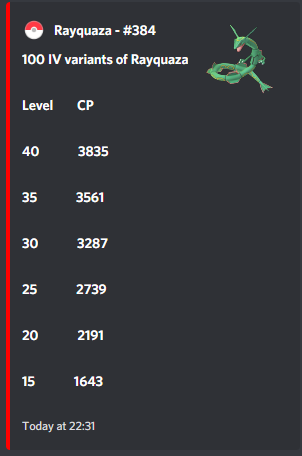
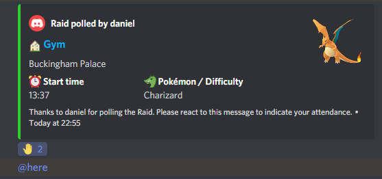

# Professor Oak Bot

Professor Oak is a Discord bot built with Pokémon (and more specifically, Pokémon GO) communities in mind.

From running an active 400+ user Pokémon GO community server myself, I am aware of what features are desirable and have attempted to include them all within Professor Oak.

I am of course always open to new feature suggestions or contributions to the code, hence why this project is almost entirely open source.

Professor Oak primarily uses the Discord.py (a Python wrapper for the Discord API) library.

All Pokémon data is sourced from: https://raw.githubusercontent.com/pokemongo-dev-contrib/pokemongo-json-pokedex/master/output/pokemon.json

## Commands showcase

| Command | Example |
| ---     | ---     |
|**Help**| The "help" command displays a list of all the commands the bot has access to. The data is dynamic and with the addition of a new command, will                                         update automatically.   |
|**Pokedex**| The "pokedex" command takes a Pokémon as input and will output relevant Pokémon GO data, such as maximum CP, types, and moves. |
|**Best**| The "best" command takes a Pokémon as input and will output 100 IV variants of that Pokémon. This could be useful for community days or for raids.
   |
|**Raid**| The "raid" command takes a Pokémon, a time/date, and a location as the input and will output a nicely formatted message displaying the information with an emoji reaction that users can click to indicate their attendance.   |
